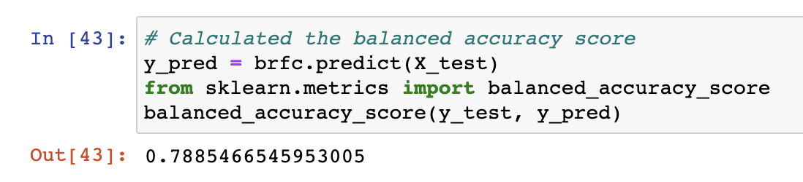

# Credit Risk Analysis

## Overview
Credit risk is a natural unbalanced classification problem, as good loans always easily outnumber risky loans. Different techniques were used to train and evaluate six models with unbalanced classes. Imbalanced-learn and scikit-learn libraries were used to build and evaluate models using resampling.

Using the credit card credit dataset from LendingClub, the data was oversampled using the RandomOverSampler and SMOTE algorithms, and undersampled using the ClusterCentroids algorithm. A combinatorial approach was then used, of over- and under-sampling using the SMOTEENN algorithm. Next, two additional machine learning models were compared, that reduce bias (BalancedRandomForestClassifier and EasyEnsembleClassifier), to predict credit risk. The performance of these models was then evaluated and a recommendation is made in the Summmary on whether any of the models should be used to predict credit risk.

## Results

### Oversampling

- Naive Random Oversampling

    The Naive Random Oversampling model resulted in the following scores (see code below):
    - Balanced Accuracy Score: 0.64 (64%)
    - Precision Score: 0.01 (1%)
    - Recall Score: 0.66 (66%)

        
        
        

- SMOTE Oversampling

    The SMOTE Oversampling model resulted in the following scores (see code below):
    - Balanced Accuracy Score: 0.65
    - Precision Score: 0.01 (1%)
    - Recall Score: 0.61 (61%)

        
        
        

### Undersampling

- ClusterCentroids Undersampling

    The ClusterCentroids Undersampling model resulted in the following scores (see code below):
    - Balanced Accuracy Score: 0.54 (54%)
    - Precision Score: 0.01 (1%)
    - Recall Score: 0.69 (69%)

        
        
        

### Combination (Over and Under) Sampling

- SMOTEENN Combination (Over and Under) Sampling

    The SMOTEENN Combination (Over and Under) Sampling model resulted in the following scores (see code below):
    - Balanced Accuracy Score: 0.64 (64%)
    - Precision Score: 0.01 (1%)
    - Recall Score: 0.72 (72%)

        
        
        

### Ensemble Learners

- Balanced Random Forest Classifier

    The Balanced Random Forest Classifier model resulted in the following scores (see code below):
    - Balanced Accuracy Score: 0.79 (79%)
    - Precision Score: 0.03 (3%)
    - Recall Score: .70 (70%)

        
        
        

- Easy Ensemble AdaBoost Classifier

    The Easy Ensemble AdaBoost Classifier model resulted in the following scores (see code below):
    - Balanced Accuracy Score: 0.93 (93%)
    - Precision Score: 0.09 (9%)
    - Recall Score: 0.92 (92%)
    
        
        
        

## Summary
Summarize the results of the machine learning models, and include a recommendation on the model to use, if any. If you do not recommend any of the models, justify your reasoning.

After analyzing the Balanced Accuracy, Precision and Recall scores for all six models, it appears that the last two models, Balanced Random Forest Classifier and Easy Ensemble Classifier, performed better than the other four models. With Balanced Accuracy Scores of 78% and 93%, respectively, it appears the approach of these models to reduce bias did a better job at predicting credit risk. 

Recommendation: With high Balanced Accuracy (93%) and Recall (92%) scores, and higher precision score than the other models (9%), it's recommended that the Easy Ensemble Classifier be used to predict credit risk.

